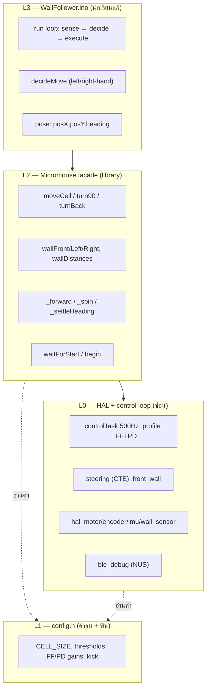
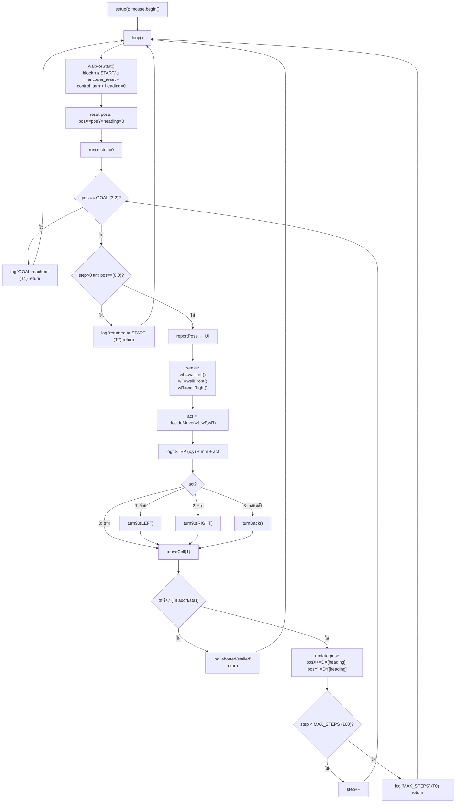
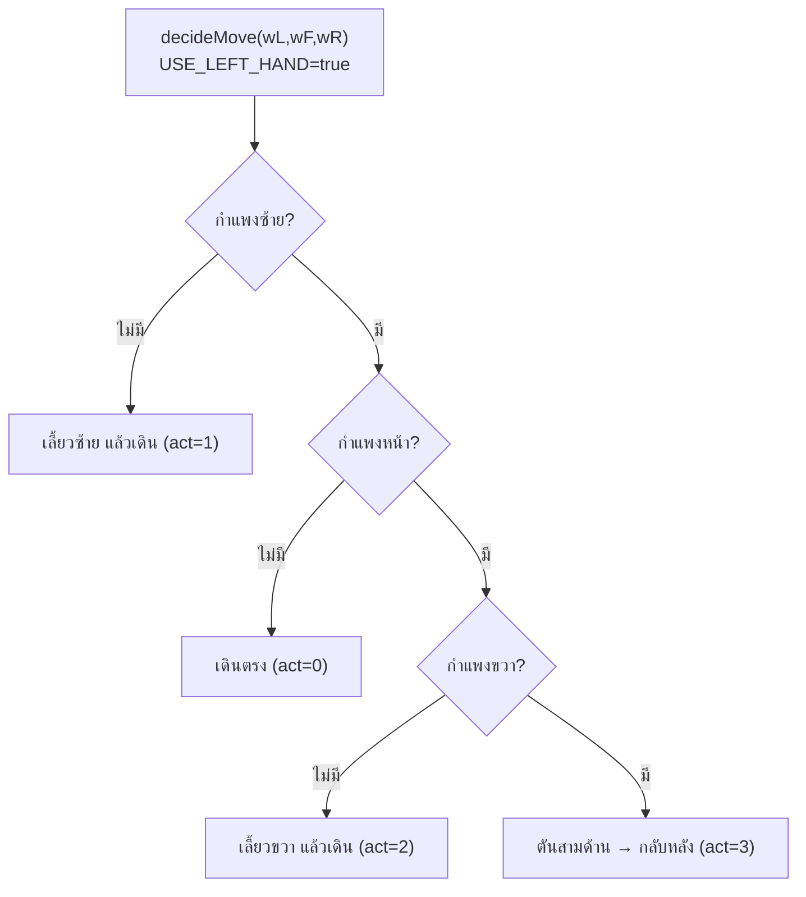
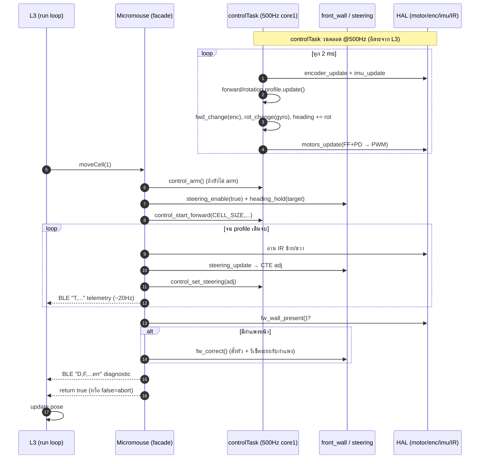
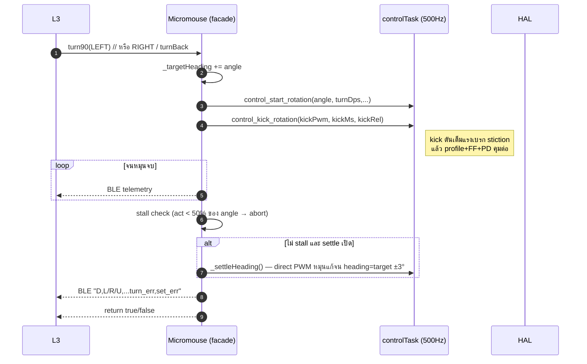

# Micromouse — ภาพรวมการทำงาน (Flowchart + Sequence)

เปิดดู Mermaid ได้ใน VS Code (ext. Markdown Preview Mermaid), GitHub, หรือ https://mermaid.live

---

## 0. สถาปัตยกรรม 4 ชั้น (ใครเรียกใคร)



---

## 1. Flowchart — ลูปหลัก (loop + run)



---

## 2. Flowchart — decideMove (Left-hand rule)



> หมายเหตุ: `wallRight()` ที่อ่านเพี้ยน (false wall) ทำให้สาขานี้เลือกผิด → พลาดทางไป goal

---

## 3. Sequence — เดินหน้า 1 ช่อง (moveCell) + control loop ที่รันคู่ขนาน



---

## 4. Sequence — หมุน 90/180 (turn90 / turnBack) + settle



---

## 5. Sequence — control task หนึ่ง tick (หัวใจ 500Hz)

```mermaid
sequenceDiagram
  autonumber
  participant T as controlTask tick
  participant E as encoder
  participant I as imu (gyro)
  participant P as profiles
  participant MC as motors_controller
  participant MO as hal_motor

  T->>E: encoder_update()
  T->>I: imu_update()
  T->>P: forward.update() + rotation.update()
  T->>T: fwd_change = Δ encoder ; rot_change = gyroZ·dt
  T->>T: heading += rot_change
  T->>T: battery critical? → disarm
  T->>MC: motors_update(v, ω, fwd_change, rot_change, steering)
  MC->>MC: PD on position error + per-wheel FF + battery comp
  MC->>MO: motor_set_speed(L_pwm, R_pwm)
  T->>T: snapshot telemetry (fwd, heading, ...)
```

---

## สรุปจุดที่กำลัง debug (ณ ปัจจุบัน)

| ส่วน | สถานะ |
|---|---|
| 500Hz control + FF+PD (เดินตรง) | ✅ ดี (err ~±1°) |
| heading-hold + _settleHeading (หลังเทิร์น) | ✅ ทำงาน (set_err ~±5°) เมื่อเทิร์นไม่ stall |
| **wallRight() sensing** | ❌ อ่านเพี้ยน (37-91mm ที่ช่องเปิด) → เลือกทางผิด → ไม่ถึง goal |
| **turn stall** | ⚠️ ครั้งเว้นครั้ง (แรงบิด/แบต) |
| pose tracking + termination (T0/T1/T2) | ✅ ถูกต้อง |
