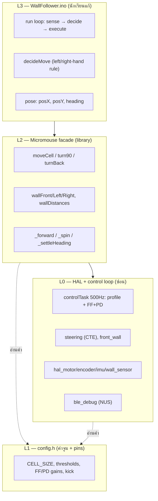
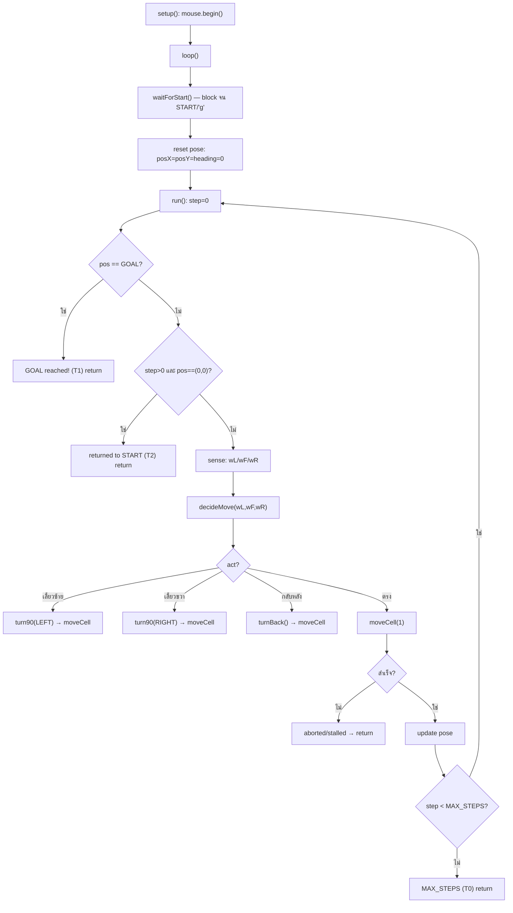
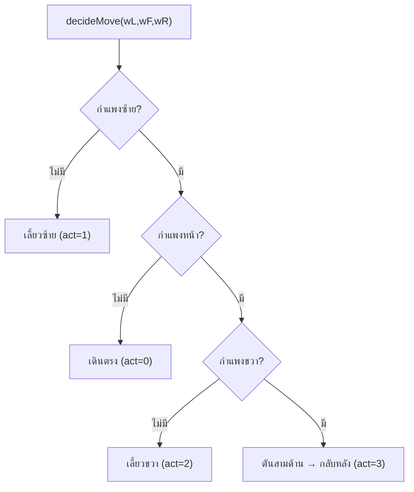
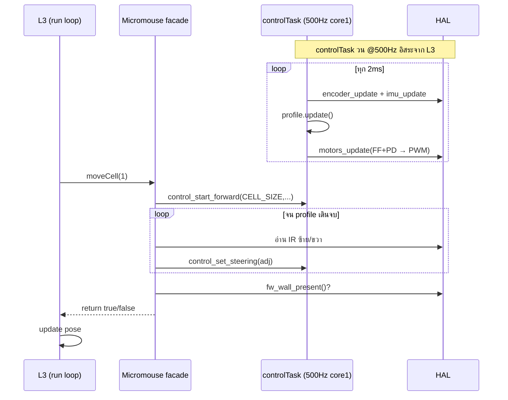
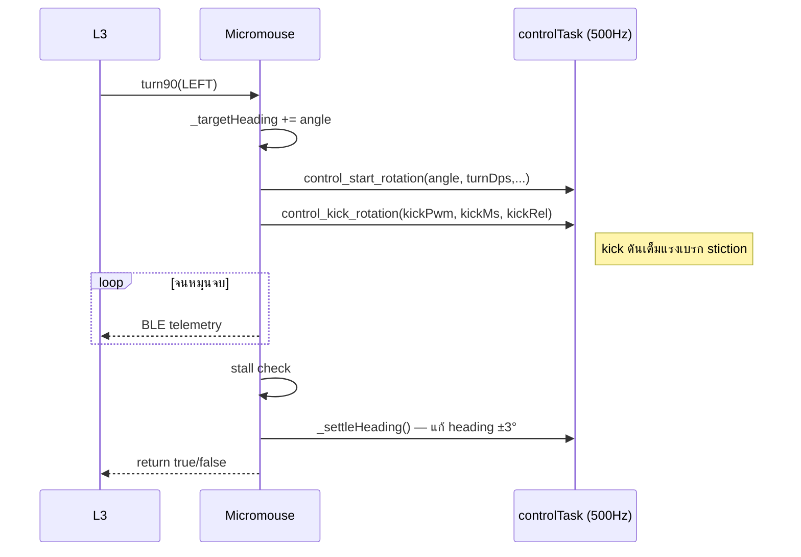

# Micromouse — Architecture & Flowcharts

> **Raw source**: `raw/micromouse_architecture.md`
> **Related**: [[micromouse]] · [[micromouse_ble]]

---

## 4-Layer Architecture

---

## Flowchart — ลูปหลัก (loop + run)

---

## Flowchart — decideMove (Left-hand Rule)

> ⚠️ `wallRight()` ที่อ่านเพี้ยน (false wall) ทำให้เลือกทางผิด → พลาดทาง goal

---

## Sequence — moveCell (เดินหน้า 1 ช่อง)

---

## Sequence — turn90 / turnBack

---

## สถานะ Debug ปัจจุบัน

| ส่วน | สถานะ | หมายเหตุ |
|---|---|---|
| 500Hz FF+PD (เดินตรง) | ✅ | err ~±1° |
| heading-hold + settleHeading | ✅ | set_err ~±5° |
| **wallRight() sensing** | ❌ | 37-91mm ที่ช่องเปิด → เลือกทางผิด |
| **turn stall** | ⚠️ | ครั้งเว้นครั้ง (แรงบิด/แบต) |
| pose tracking + termination | ✅ | T0/T1/T2 ถูกต้อง |

---

## See Also

- [[micromouse]] — ภาพรวม + lab guide
- [[micromouse_ble]] — BLE wireless testing
